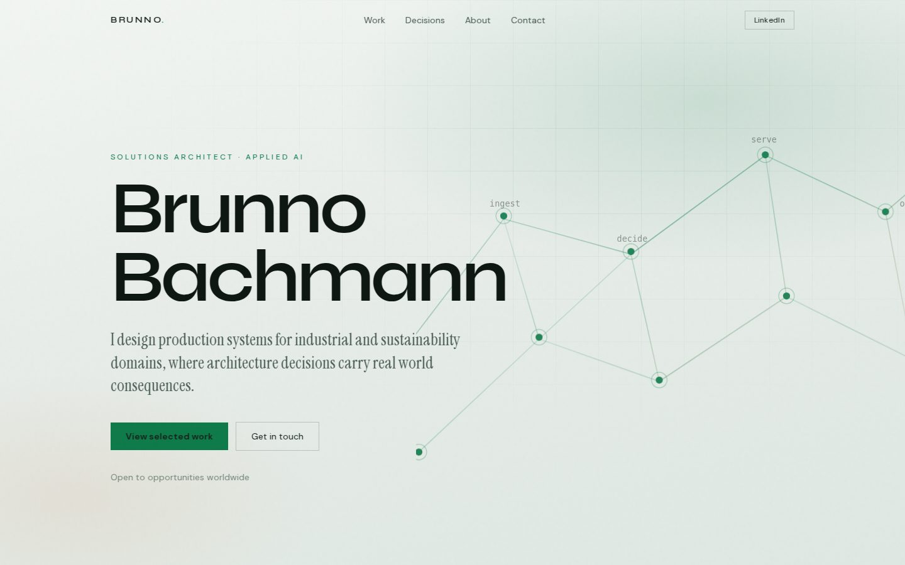
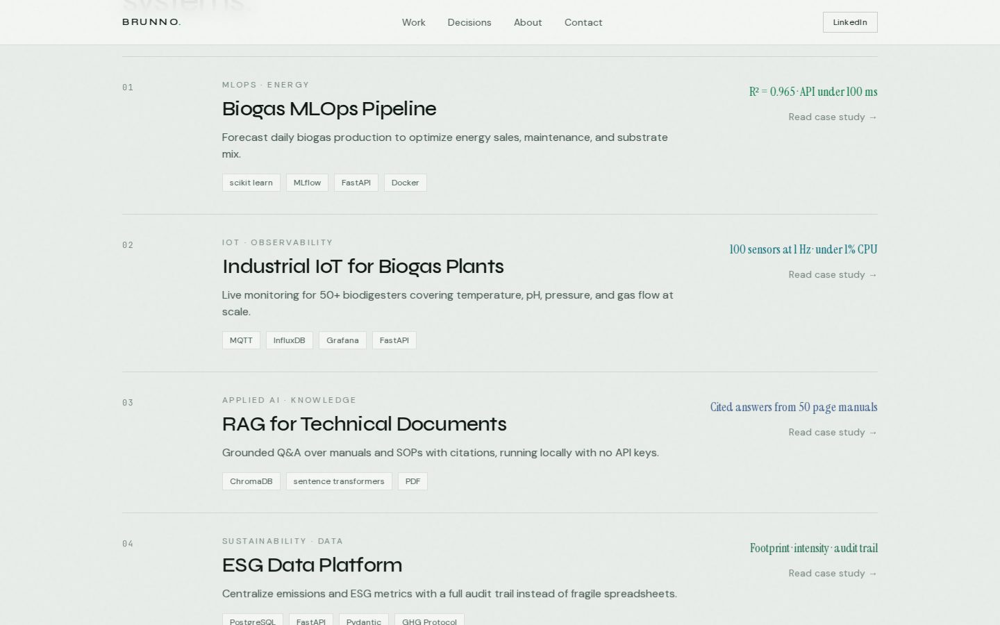
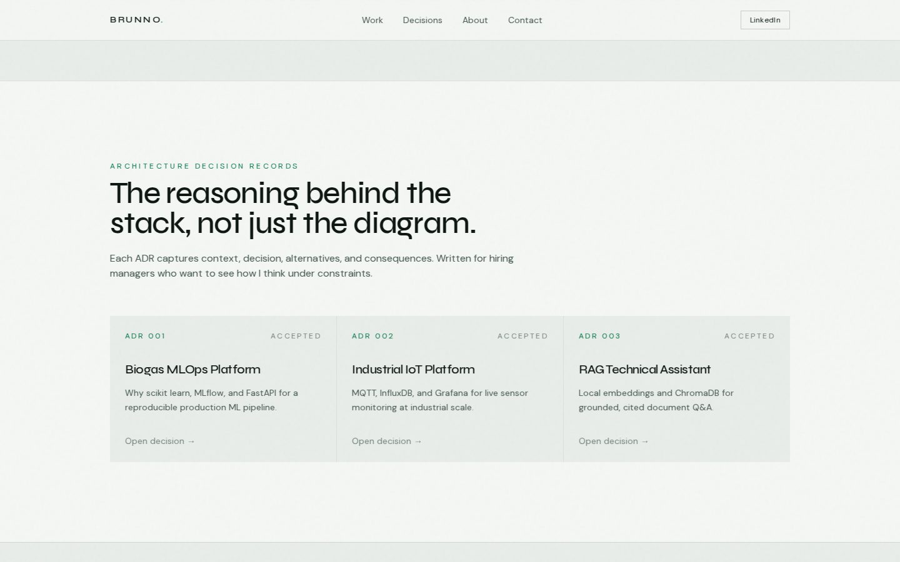
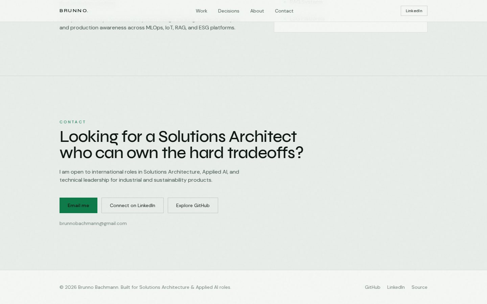
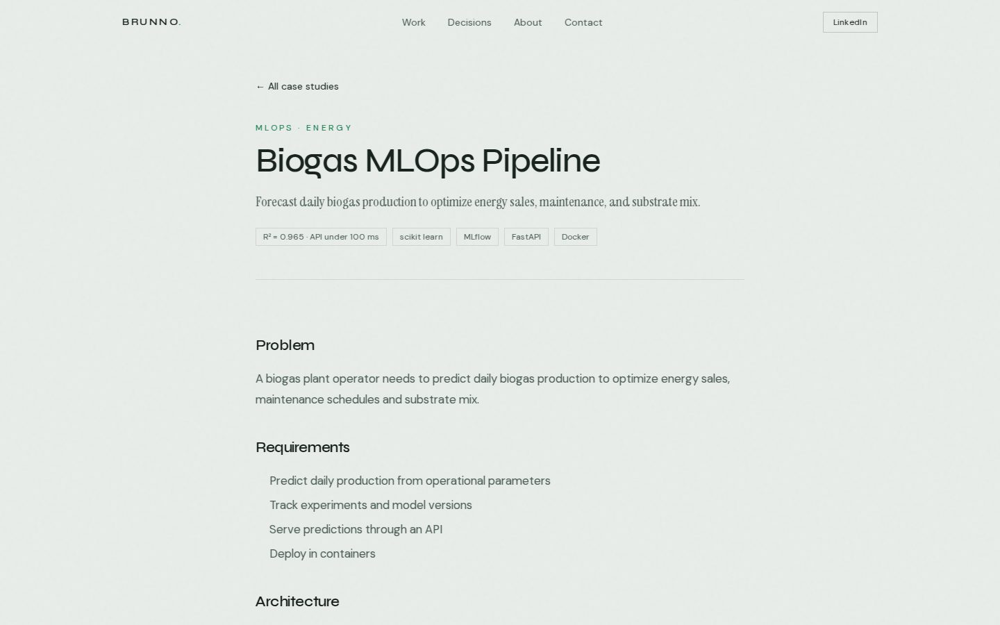
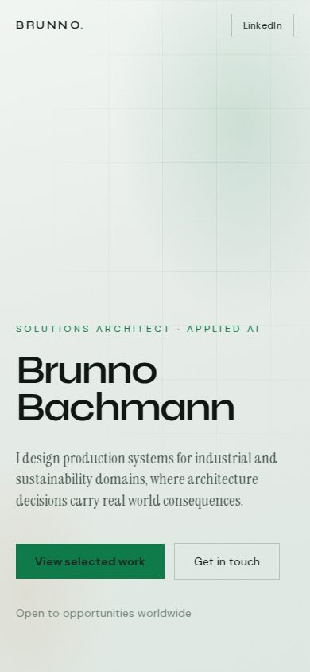

# Brunno Bachmann · System Design Portfolio

**Solutions Architecture & Applied AI**: architecture case studies, decision records, and tradeoff analysis for industrial and sustainability systems.

Built with **Next.js** for international Solutions Architect / Applied AI applications.

## Live preview

Run locally:

```bash
npm install
npm run dev
```

Open [http://localhost:3000](http://localhost:3000).

## Screenshots

### Hero


### Selected work


### Architecture Decision Records


### Contact


### Case study page


### Mobile


## What this portfolio demonstrates

* **System design thinking:** end to end architectures for production systems
* **Tradeoff analysis:** ADRs with alternatives and consequences
* **Domain expertise:** renewable energy, biogas, sustainability, industrial IoT
* **Communication:** clear written explanations for technical and non technical audiences
* **Production awareness:** scalability, observability, data quality, security

## Contents

### Case studies
* [Biogas MLOps Pipeline](content/case-studies/biogas-mlops.md)
* [Industrial IoT for Biogas Plants](content/case-studies/industrial-iot-biogas.md)
* [RAG for Technical Documents](content/case-studies/rag-technical-documents.md)
* [ESG Data Platform](content/case-studies/esg-data-platform.md)
* [Multi Agent Sales Platform](content/case-studies/multi-agent-sales-platform.md)

### Architecture Decision Records
* [ADR 001: Biogas MLOps Platform](content/adrs/001-biogas-mlops-architecture.md)
* [ADR 002: Industrial IoT Platform](content/adrs/002-industrial-iot-platform.md)
* [ADR 003: RAG Technical Assistant](content/adrs/003-rag-technical-assistant.md)

## Stack

* Next.js (App Router) + TypeScript + Tailwind CSS
* Markdown content under `content/` rendered in the app
* Designed for deploy on Vercel (`npm run build`)

## Connect

Built by [Brunno Bachmann](https://www.linkedin.com/in/brunno-bachmann-865429173) · [GitHub](https://github.com/Brunnobach) · brunnobachmann@gmail.com

Open to Solutions Architecture, Applied AI, and technical leadership roles worldwide.

## License

MIT
