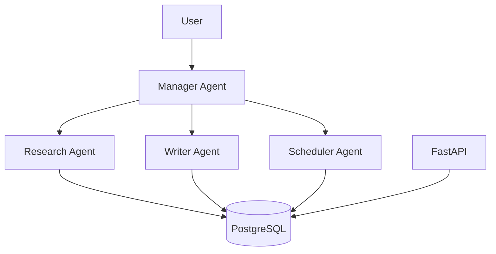

# Case Study: Multi-Agent Sales Platform

## Problem
A sales team needs to manage leads, track follow-ups and generate proposals without losing context across different tools.

## Requirements
- Hierarchical agent structure (manager + sub-agents)
- Multi-tenant workspace isolation
- Persistent memory of conversations
- Integration with CRM via API

## Architecture

## Key design decisions
- Next.js frontend for modern UX
- FastAPI backend for agent orchestration
- PostgreSQL for structured data and memory
- Docker for reproducible deployment

## Trade-offs
| Option | Pros | Cons |
|--------|------|------|
| Monolithic agents | Simpler to build | Less flexible |
| Hierarchical agents | Better task decomposition | More complex orchestration |
| External LLM APIs | Better reasoning | Cost and latency |

## Outcome
A working prototype with manager agent and sub-agents for research, writing and scheduling.

## Lessons learned
- Agent orchestration is harder than single-agent design
- Memory and context management are critical
- Multi-tenancy must be designed from the start
