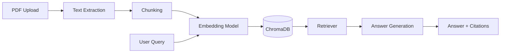

# Case Study: RAG for Technical Document Search

## Problem
A maintenance team has hundreds of equipment manuals, SOPs and safety documents. Finding the right information is slow and error-prone.

## Requirements
- Upload PDFs and ask questions in natural language
- Answers must cite the source document and page
- Run locally without proprietary LLM APIs
- Easy to update when documents change

## Architecture

## Key design decisions
- Local sentence-transformer for embeddings
- ChromaDB for vector storage
- Overlapping chunks to preserve context
- Top-k retrieval with similarity threshold

## Trade-offs
| Option | Pros | Cons |
|--------|------|------|
| Local embeddings | No API cost, privacy | Lower quality than OpenAI |
| OpenAI embeddings | Higher quality | Cost, latency, dependency |
| Larger context window | Fewer chunks needed | More expensive, slower |

## Outcome
The assistant can answer technical questions from a 50-page manual and cite the relevant section.

## Lessons learned
- Chunk size and overlap are the most important hyperparameters
- Retrieval quality beats generation quality in RAG
- User feedback loop is essential for continuous improvement
