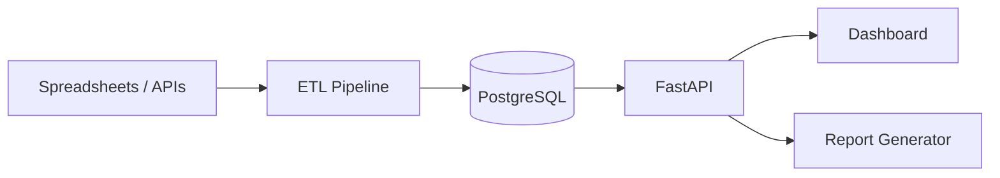

# Case Study: ESG Data Platform

## Problem
A sustainability team needs to collect, calculate and report ESG metrics across multiple business units. Spreadsheets are error prone and hard to audit.

## Requirements
* Centralize emissions, energy, water and waste data
* Calculate carbon intensity and ESG scores
* Provide audit trail
* Export reports for stakeholders

## Architecture

## Key design decisions
* PostgreSQL with relational schema for auditability
* Standard emission factors (GHG Protocol) for scope 1, 2 and 3 estimates
* Pydantic schemas for validation
* API first design for integration with BI tools

## Tradeoffs
**Relational DB:** Auditable and familiar. Less flexible than document stores.

**Dedicated ESG SaaS:** Pre built reports. Vendor lock in and recurring cost.

**Data lake:** Scales well. Overkill for a mid size company.

## Outcome
The platform can calculate total carbon footprint, intensity per revenue and a composite ESG score for sample companies.

## Lessons learned
* Data quality is the hardest part of ESG reporting
* Standard factors are a starting point; real measurements are better
* Audit trail is non negotiable for regulatory reporting
