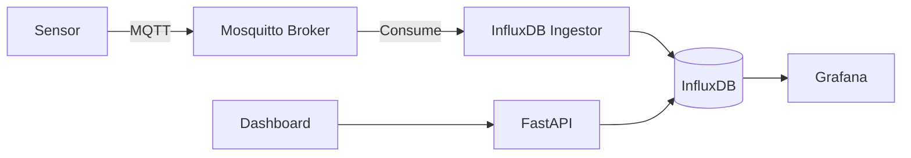

# Case Study: Industrial IoT for Biogas Plants

## Problem
A network of 50+ biodigesters needs remote monitoring of temperature, pH, pressure and gas flow. Data must be ingested live, stored efficiently and visualized for operators.

## Requirements
* Support thousands of messages per second
* Retain high resolution data for 1 year
* Query aggregates by sensor, plant and time range
* Alert on abnormal values

## Architecture

## Key design decisions
* MQTT for low bandwidth, unreliable network conditions
* InfluxDB for time series compression and retention policies
* FastAPI as a thin API layer for business applications
* Grafana for operations dashboards

## Tradeoffs
**InfluxDB:** Purpose built and efficient. Query language is less familiar than SQL.

**TimescaleDB:** SQL compatible. More operational overhead.

**Kafka:** Scalable and durable. Heavy for this scale.

## Outcome
The platform can ingest simulated data from 100 sensors at 1 Hz with under 1% CPU usage on modest hardware.

## Lessons learned
* Time series databases dramatically simplify operational analytics
* MQTT topic design is critical for scalability
* Alerts must be actionable, not noisy
